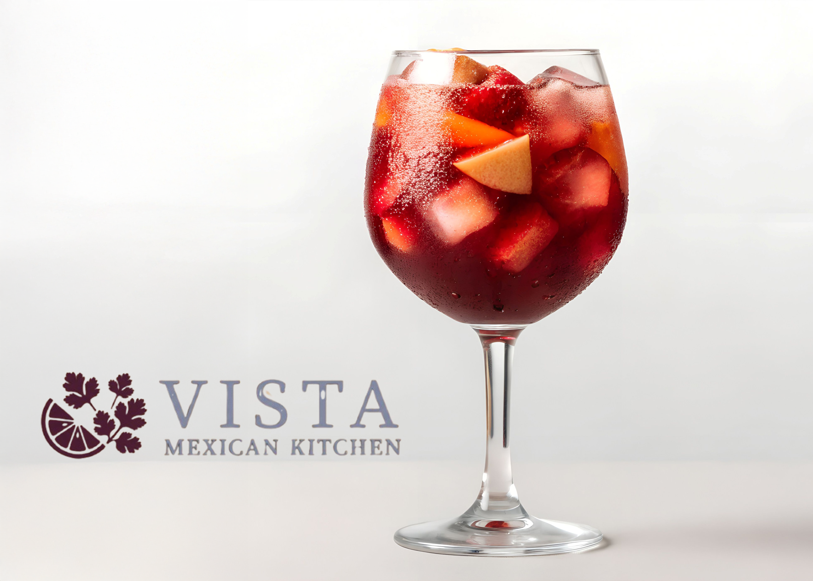

# Vista Mexican Kitchen

A responsive restaurant website built as a front-end portfolio project. Designed to showcase a fictional upscale Mexican restaurant with a focus on clean UI, mobile-first layout, and polished code.

## Features

- Fully responsive across desktop, tablet, and mobile (down to 320px)
- Hero section with autoplay background video
- Menu, Specials, Happy Hour, and Gallery sections
- Reservation call-to-action
- Email newsletter signup in the footer
- Smooth scroll navigation with hamburger menu on mobile
- Accessible markup with semantic HTML5

## Built With

- HTML5
- CSS3 (BEM methodology, CSS custom properties)
- Vanilla JavaScript
- Google Fonts — Source Serif 4, Raleway

## Preview

## Author

Aubrey Cavness — [github.com/aubreycavness83](https://github.com/aubreycavness83)
